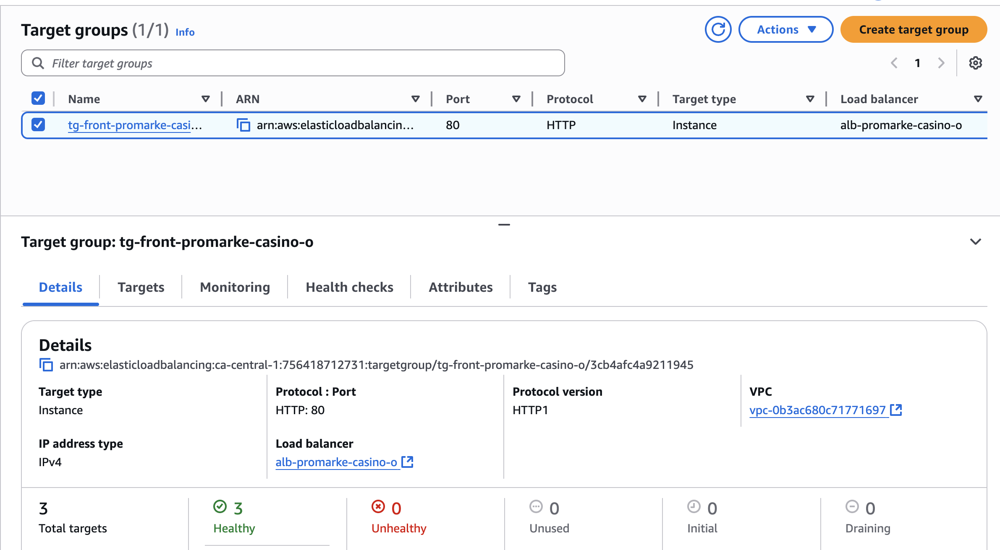

# Infraestructura AWS para Proyecto Promarke Casino

Este repositorio contiene la configuración de infraestructura en **AWS** utilizando **Terraform** para desplegar el proyecto **Promarke Casino**. La infraestructura incluye:

- VPC principal y VPC de datos
- Subnets públicas, privadas y para bases de datos
- Internet Gateway y NAT Gateway
- Route Tables y asociaciones
- Security Groups para ALB, EC2, Redis y RDS
- Application Load Balancer (ALB) con Target Groups y Listeners
- Launch Templates y Auto Scaling Group (ASG)
- Redis (ElastiCache)
- RDS MySQL en VPC de datos con VPC Peering
- S3 para contenido estático y CloudFront Distribution

---

## Requisitos Previos

Antes de desplegar la infraestructura, asegúrate de tener:

- AWS CLI configurado con credenciales válidas
- Terraform ≥ 1.5 instalado
- Acceso a la región AWS que se va a utilizar
- Claves SSH para acceso a instancias EC2

---

## Archivos del Proyecto

- `main.tf` → Configuración principal de recursos AWS
- `variables.tf` → Definición de variables utilizadas en la infraestructura
- `outputs.tf` → Salidas útiles de la infraestructura (IPs, IDs de recursos)
- `terraform.tfvars` → Valores de variables específicas del proyecto
- `userdata/front-userdata.sh` → Script de inicialización de instancias EC2
- `README.md` → Este documento

---

## Variables Principales

| Variable                  | Descripción                                     | Ejemplo / Default                  |
|----------------------------|-------------------------------------------------|-----------------------------------|
| `project_name`             | Nombre del proyecto                             | `PromarkeCasino`                  |
| `operation_name`           | Nombre de la operación                          | `CasinoOps`                       |
| `main_vpc_cidr`            | CIDR de la VPC principal                        | `10.0.0.0/16`                     |
| `data_vpc_cidr`            | CIDR de la VPC de datos                          | `10.1.0.0/16`                     |
| `public_subnet_cidrs`      | Lista de CIDRs para subnets públicas            | `["10.0.10.0/24","10.0.20.0/24"]` |
| `private_subnet_cidrs`     | Lista de CIDRs para subnets privadas            | `["10.0.110.0/24","10.0.120.0/24"]`|
| `database_subnet_cidrs`    | Lista de CIDRs para subnets de base de datos   | `["10.1.10.0/24","10.1.20.0/24"]` |
| `ami_id`                   | ID de la AMI para EC2                           | `ami-0bb9349907edabf10`           |
| `instance_type`            | Tipo de instancia EC2                           | `t3.medium`                        |
| `key_pair_name`            | Nombre del Key Pair para SSH                    | `promarke-key`                     |
| `rds_instance_class`       | Clase de la instancia RDS                        | `db.t3.medium`                     |
| `database_name`            | Nombre de la base de datos                       | `promarkedb`                       |
| `database_username`        | Usuario administrador de la base de datos       | `admin`                            |
| `database_password`        | Contraseña del usuario administrador            | `CambiarPorSegura123!`             |
| `redis_node_type`          | Tipo de nodo Redis                               | `cache.t3.micro`                   |
| `min_instances`            | Mínimo de instancias en ASG                      | `1`                                |
| `max_instances`            | Máximo de instancias en ASG                      | `3`                                |
| `desired_instances`        | Cantidad deseada de instancias en ASG           | `2`                                |

---

## Pasos para Desplegar

1. Inicializar Terraform:
```bash
terraform init

2. Verificar el plan de despliegue:
```bash
terraform plan -var-file="terraform.tfvars"

3. Aplicar la infraestructura:
```bash
terraform apply -var-file="terraform.tfvars"

4. Verificar los outputs para obtener información de la infraestructura:
```bash
terraform output

(Opcional) Para destruir toda la infraestructura:
```bash
terraform destroy -var-file="terraform.tfvars"

```
Diagrama de EC2


Diagrama de VPC y Subnets


ALB, ASG y Target Groups





RDS y Redis


CloudFront y S3


Notas Adicionales

Asegúrate de que las subnets de bases de datos no entren en conflicto con otras subnets existentes en la VPC de datos.

La comunicación entre VPC principal y VPC de datos se realiza mediante VPC Peering, por lo que los security groups y rutas deben estar correctamente configurados.

Todos los recursos tienen etiquetas (tags) consistentes para facilitar la identificación y administración.

